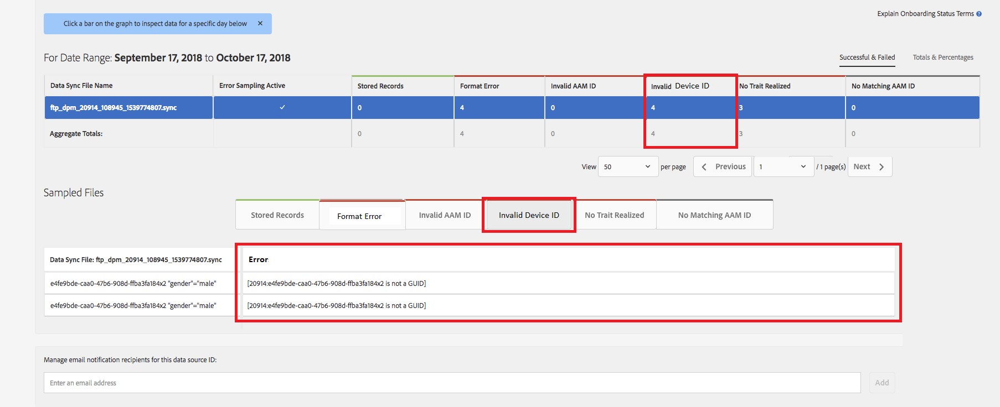

# Validierung der globalen Geräte-ID {#global-device-id-validation}

Geräte-Advertising-IDs (d. h. iDFA, GAID, Roku-ID) haben Formatierungsstandards, die erfüllt sein müssen, damit sie im digitalen Werbe-Ökosystem verwendet werden können. Heute können Kunden und Partner IDs in jedem beliebigen Format in unsere globalen Datenquellen hochladen, ohne darüber informiert zu werden, ob die ID ordnungsgemäß formatiert ist. Diese Funktion führt die Validierung von Geräte-IDs ein, die zur ordnungsgemäßen Formatierung an die globalen Datenquellen gesendet werden, und bietet Fehlermeldungen, wenn IDs falsch formatiert sind. Bei der Einführung wird die Validierung für [!DNL iDFA], [!DNL Google Advertising] und [!DNL Roku IDs] unterstützt.

## Übersicht über Formatstandards {#overview-of-format-standards}

Im Folgenden finden Sie die globalen Geräte-Advertising ID-Pools, die derzeit von AAM erkannt und unterstützt werden. Diese werden als freigegebene [!UICONTROL Data Sources] implementiert, die von jedem Kunden oder Datenpartner verwendet werden können, der mit Daten arbeitet, die an Benutzer dieser Plattformen gebunden sind.

<table>
  <tr>
   <td>Plattform </td>
   <td>AAM Data Source ID </td>
   <td>ID-Format </td>
   <td>AAM PID </td>
   <td>Hinweise </td>
  </tr>
  <tr>
   <td>Google Android (GAID)</td>
   <td>20914</td>
   <td>32 Hexadezimalzahlen, im Allgemeinen dargestellt als 8-4-4-12<em>Beispiel, 97987BCA-AE59-4C7D-94BA-EE4F19AB8C21  </em> </td>
   <td>1352</td>
   <td>Diese ID muss in einer Referenz in unformatierter/ungehashter/unveränderter Form erfasst werden - <a href="https://play.google.com/about/monetization-ads/ads/ad-id/">https://play.google.com/about/monetization-ads/ads/ad-id/</a></td>
  </tr>
  <tr>
   <td>Apple iOS (IDFA)</td>
   <td>20915</td>
   <td>32 Hexadezimalzahlen, allgemein dargestellt als 8-4-4-4-12 <em>z. B. 6D92078A-8246-4BA4-AE5B-76104861E7DC  </em> </td>
   <td>3560</td>
   <td>Diese ID muss in einer Referenz in unformatierter/ungehashter/unveränderter Form erfasst werden - <a href="https://support.apple.com/en-us/HT205223">https://support.apple.com/en-us/HT205223</a></td>
  </tr>
  <tr>
   <td>Roku (RIDA)</td>
   <td>121963</td>
   <td>32 Hexadezimalzahlen, im Allgemeinen dargestellt als 8-4-4-4-12 <em>Beispiel,</em> <em>FCB2A29C-315A-5E6B-BCFD-D889BA19AADA</em></td>
   <td>11536</td>
   <td>Diese ID muss in einer Referenz in unformatierter/ungehashter/unveränderter Form erfasst werden - <a href="https://sdkdocs.roku.com/display/sdkdoc/Roku+Advertising+Framework">https://sdkdocs.roku.com/display/sdkdoc/Roku+Advertising+Framework</a> </td>
  </tr>
  <tr>
   <td>Microsoft Advertising ID (MAID)</td>
   <td>389146</td>
   <td>Numerische Zeichenfolge des Alphas</td>
   <td>14593</td>
   <td>Diese ID muss in einem Formularverweis (Roh/Ungehasht/Unverändert) erfasst werden - <a href="https://docs.microsoft.com/en-us/uwp/api/windows.system.userprofile.advertisingmanager.advertisingid">https://docs.microsoft.com/en-us/uwp/api/windows.system.userprofile.advertisingmanager.advertisingid</a> <a href="https://msdn.microsoft.com/en-us/library/windows/apps/windows.system.userprofile.advertisingmanager.advertisingid.aspx">https://msdn.microsoft.com/en-us/library/windows/apps/windows.system.userprofile.advertisingmanager.advertisingid.aspx</a></td>
  </tr>
  <tr>
   <td>Samsung DUID</td>
   <td>404660</td>
   <td>Beispiel für eine numerische Alpha-Zeichenfolge, 7XCBNROQJQPYW</td>
   <td>15950</td>
   <td>Diese ID muss in einer Referenz in unformatierter/ungehashter/unveränderter Form erfasst werden - <a href="https://developer.samsung.com/tv/develop/api-references/samsung-product-api-references/productinfo-api">https://developer.samsung.com/tv/develop/api-references/samsung-product-api-references/productinfo-api</a> </td>
  </tr>
</table>

## Festlegen einer Advertising-Kennung in der App {#setting-an-advertising-identifier-in-the-app}

Das Festlegen der Advertiser-ID in der App ist wirklich ein zweistufiger Prozess, zunächst wird die Advertiser-ID abgerufen und dann an die Experience Cloud gesendet. Unten finden Sie Links zum Ausführen dieser Schritte.

1. Abrufen der ID
   1. [!DNL Apple] Informationen über die [!DNL advertising ID] finden Sie [HIER](https://developer.apple.com/documentation/adsupport/asidentifiermanager).
   1. Einige Informationen zum Festlegen der [!DNL advertiser ID] für [!DNL Android]-Entwickler finden Sie [HIER](http://android.cn-mirrors.com/google/play-services/id.html).
1. Senden Sie sie mithilfe der [!DNL setAdvertisingIdentifier] in der SDK an die Experience Cloud
   1. Informationen zur Verwendung von `setAdvertisingIdentifier` finden Sie in der [Dokumentation](https://aep-sdks.gitbook.io/docs/using-mobile-extensions/mobile-core/identity/identity-api-reference#set-an-advertising-identifier) sowohl für [!DNL iOS] als auch für [!DNL Android].

`// iOS (Swift) example for using setAdvertisingIdentifier:`
`ACPCore.setAdvertisingIdentifier([AdvertisingId]) // ...where [AdvertisingId] is replaced by the actual advertising ID`

## DCS-Fehlermeldung bei falschen IDs  {#dcs-error-messaging-for-incorrect-ids}

Wenn eine falsche globale Geräte-ID (IDFA, GAID usw.) in Echtzeit an den Audience Manager übermittelt wird, wird beim Treffer ein Fehlercode zurückgegeben. Im Folgenden finden Sie ein Beispiel für einen zurückgegebenen Fehler, da die ID als [!DNL Apple IDFA] gesendet wird, die nur Großbuchstaben enthalten sollte, und dennoch ein Kleinbuchstabe „x“ in der ID vorhanden ist.

Eine Liste der Fehlercodes finden [ in ](https://experienceleague.adobe.com/docs/audience-manager/user-guide/api-and-sdk-code/dcs/dcs-api-reference/dcs-error-codes.html?lang=de#api-and-sdk-code) Dokumentation.

## Onboarding von globalen Geräte-IDs {#onboarding-global-device-ids}

Zusätzlich zur Echtzeit-Übermittlung von globalen Geräte-IDs können Sie auch Daten mit den IDs &quot;[!DNL onboard]&quot; (hochladen). Dieser Prozess ist der gleiche wie beim Onboarding von Daten mit Ihren Kunden-IDs (normalerweise über Schlüssel/Wert-Paare), Sie würden jedoch einfach die richtigen Data Source-IDs verwenden, damit die Daten der globalen Geräte-ID zugewiesen werden. Eine Dokumentation zum Onboarding-Prozess finden Sie in der [Dokumentation](https://experienceleague.adobe.com/docs/audience-manager/user-guide/implementation-integration-guides/sending-audience-data/batch-data-transfer-process/batch-data-transfer-overview.html?lang=de#implementation-integration-guides). Denken Sie daran, je nach verwendeter Plattform die globale Datenquellen-ID zu verwenden.

Wenn über den Onboarding-Prozess falsche globale Geräte-IDs gesendet werden, werden die Fehler in der [[!DNL Onboarding Status Report]](https://experienceleague.adobe.com/docs/audience-manager/user-guide/reporting/onboarding-status-report.html?lang=de#reporting) angezeigt.

Im Folgenden finden Sie ein Beispiel für einen Fehler, der durch diesen Bericht verursacht würde:

