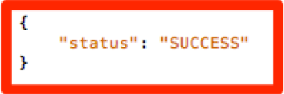

# Migrieren der Audience Manager-Implementierung Ihrer Site von der clientseitigen DIL zur serverseitigen Weiterleitung {#migrating-your-site-s-aam-implementation-from-client-side-dil-to-server-side-forwarding}

Dieses Tutorial gilt für Sie, wenn Sie sowohl über Adobe Audience Manager (AAM) als auch Adobe Analytics verfügen und derzeit einen Treffer von der Seite an AAM mit DIL ([!DNL Data Integration Library])-Code senden und außerdem einen Treffer von der Seite an Adobe Analytics senden. Da Sie über beide Lösungen verfügen und beide Teil der Adobe Experience Cloud sind, haben Sie die Möglichkeit, die Best Practice zu befolgen, die serverseitige Weiterleitung zu aktivieren. Dadurch können die [!DNL Analytics] -Datenerfassungsserver die Site-Analysedaten in Echtzeit an den Audience Manager weiterleiten, anstatt einen zusätzlichen Treffer von der Seite an AAM senden zu müssen. Dieses Tutorial führt Sie durch die Schritte, die erforderlich sind, um den Wechsel von der älteren clientseitigen DIL-Implementierung zur neueren serverseitigen Weiterleitungsmethode herzustellen.

## Clientseitig (DIL) und serverseitig {#client-side-dil-vs-server-side}

Beim Vergleichen und Vergleichen dieser beiden Methoden zur Datenübernahme in AAM kann es hilfreich sein, die Unterschiede im folgenden Bild zu visualisieren:

### Clientseitige DIL-Implementierung {#client-side-dil-implementation}

Wenn Sie diese Methode verwenden, um Adobe Analytics-Daten in AAM zu übertragen, erhalten Sie zwei Treffer von Ihren Webseiten: einen Treffer, der an [!DNL Analytics] gesendet wird, und einen, der an AAM geht (nachdem Sie die [!DNL Analytics] -Daten auf der Webseite kopiert haben. [!UICONTROL Segments] werden von AAM an die Seite zurückgegeben, wo sie für die Personalisierung verwendet werden können usw. Dies gilt als veraltete Implementierung und wird nicht mehr empfohlen.

Abgesehen davon, dass dies nicht den Best Practices folgt, bestehen die Nachteile der Verwendung dieser Methode darin,

* Zwei Treffer von der Seite anstelle von nur einem
* Die serverseitige Weiterleitung ist für die Echtzeit-Freigabe AAM Zielgruppen an [!DNL Analytics] erforderlich, sodass clientseitige Implementierungen diese Funktion (und möglicherweise weitere zukünftige Funktionen) nicht zulassen.

Es wird empfohlen, zu einer serverseitigen Weiterleitungsmethode für AAM Implementierung zu wechseln.

### Implementierung der serverseitigen Weiterleitung {#server-side-forwarding-implementation}

Wie in der Abbildung oben gezeigt, kommt ein Treffer von der Webseite nach Adobe Analytics. [!DNL Analytics] leitet diese Daten dann an AAM in Echtzeit weiter und Besucher werden in AAM Eigenschaften und [!UICONTROL segments] ausgewertet, so als ob der Treffer direkt von der Seite kam.

[!UICONTROL Segments] wird bei demselben Echtzeit-Treffer zurück zu [!DNL Analytics] zurückgegeben, wodurch die Antwort zur Personalisierung an die Webseite weitergeleitet wird usw.

Für die Umstellung auf die serverseitige Weiterleitung gibt es kein Timing nach unten. Adobe empfiehlt dringend, dass jeder, der sowohl über Audience Manager als auch über [!DNL Analytics] verfügt, diese Implementierungsmethode verwendet.

## Sie haben zwei Hauptaufgaben. {#you-have-two-main-tasks}

Auf dieser Seite gibt es eine Menge Informationen, und es ist natürlich alles wichtig. Es werden jedoch insgesamt **zwei wichtige Dinge benötigt, die Sie tun müssen:**

1. Ändern Sie den Code vom clientseitigen DIL-Code in den serverseitigen Weiterleitungs-Code
1. Spiegeln Sie den Schalter in [!DNL Analytics] [!DNL Admin Console], um die tatsächliche Datenweiterleitung zu starten (pro [!UICONTROL report suite]).

Wenn Sie eine dieser Aufgaben überspringen, funktioniert die serverseitige Weiterleitung nicht ordnungsgemäß. In diesem Dokument wurden Schritte und zusätzliche Daten hinzugefügt, die Ihnen bei der korrekten Durchführung dieser beiden Schritte bei der Einrichtung helfen.

## Implementierungsoptionen {#implementation-options}

Wenn Sie von der clientseitigen zur serverseitigen Weiterleitung wechseln, besteht eine der Aufgaben darin, den Code in den neuen serverseitigen Weiterleitungscode zu ändern. Dies geschieht mit einer der folgenden Optionen:

* Adobe Experience Platform-Tags - Empfohlene Implementierungsoption für Webeigenschaften Adobe Sie werden sehen, dass dies eine einfache Aufgabe ist, da Platform-Tags die ganze Arbeit für Sie erledigt haben.
* Auf der Seite - Sie können den neuen SSF-Code auch direkt in die Funktion `doPlugins` in Ihrer `appMeasurement.js`-Datei platzieren, wenn Sie (noch) nicht mit Adobe Launch arbeiten
* Andere Tag-Manager - Diese können wie die vorherige Option (auf der Seite) behandelt werden, da Sie den SSF-Code dennoch in `doPlugins` platzieren, wo immer der andere Tag-Manager den [!DNL AppMeasurement] -Code speichert

Im Abschnitt _Aktualisieren des Codes_ werden wir uns jeden dieser Punkte ansehen.

## Implementierungsschritte {#implementation-steps}

Die folgenden Schritte beschreiben die Implementierung.

### Schritt 0: Voraussetzung: Experience Cloud ID-Dienst (ECID) {#step-prerequisite-experience-cloud-id-service-ecid}

Die wichtigste Voraussetzung für den Wechsel zur serverseitigen Weiterleitung besteht darin, den Experience Cloud ID-Dienst implementieren zu lassen. Dies ist am einfachsten, wenn Sie Experience Platform Launch verwenden. In diesem Fall installieren Sie einfach die ECID-Erweiterung und der Rest wird ausgeführt.

Wenn Sie ein Nicht-Adobe-TMS oder gar kein TMS verwenden, implementieren Sie ECID, um **vor** anderen Adobe-Lösungen auszuführen. Weitere Informationen finden Sie in der [ECID-Dokumentation](https://experienceleague.adobe.com/docs/id-service/using/home.html) . Die einzige andere Voraussetzung betrifft Codeversionen. Wenn Sie also einfach die neuesten Versionen des Codes in den folgenden Schritten anwenden, ist Ihnen das recht.

>[!NOTE]
>
>Lesen Sie vor der Implementierung dieses gesamten Dokuments. Der unten stehende Abschnitt &quot;Timing&quot;enthält wichtige Informationen zu *wann* Sie jedes Element implementieren sollten, einschließlich ECID (sofern es noch nicht implementiert ist).

### Schritt 1: Derzeit verwendete Optionen aus dem DIL-Code aufzeichnen {#step-record-currently-used-options-from-dil-code}

Wenn Sie sich darauf vorbereiten, von clientseitigem DIL-Code zur serverseitigen Weiterleitung zu wechseln, besteht der erste Schritt darin, alles zu identifizieren, was Sie mit DIL-Code tun, einschließlich benutzerdefinierter Einstellungen und Daten, die an AAM gesendet werden. Zu beachten und zu berücksichtigen sind unter anderem:

* Normale [!DNL Analytics] -Variablen, die das `siteCatalyst.init` -DIL-Modul verwenden - Sie müssen sich keine Gedanken um diese Variable machen, da ihre Aufgabe darin besteht, einfach die normalen [!DNL Analytics] -Variablen zu senden, und dies geschieht durch die einfache Aktivierung der serverseitigen Weiterleitung.
* Partner-Subdomäne - Notieren Sie sich in der Funktion `DIL.create` den Parameter `partner` . Dies wird als &quot;Partner-Subdomäne&quot;oder manchmal als &quot;Partner-ID&quot;bezeichnet und wird benötigt, wenn Sie den neuen serverseitigen Weiterleitungscode platzieren.
* [!DNL Visitor Service Namespace] - Auch als Ihr &quot;[!DNL Org ID]&quot; oder &quot;[!DNL IMS Org ID]&quot; bezeichnet, benötigen Sie dies auch bei der Einrichtung des neuen serverseitigen Weiterleitungscodes. Notieren Sie sich das.
* containerNSID, uuidCookie und andere erweiterte Optionen - Notieren Sie sich alle zusätzlichen erweiterten Optionen, die Sie verwenden, damit Sie sie auch im serverseitigen Weiterleitungscode festlegen können.
* Zusätzliche Seitenvariablen - Wenn von der Seite aus weitere Variablen an AAM gesendet werden (zusätzlich zu den normalen [!DNL Analytics] -Variablen, die von SiteCatalyst.init verarbeitet werden), müssen Sie diese beachten, damit sie über die serverseitige Weiterleitung (Spoiler-Warnung: über [!DNL contextData] -Variablen) gesendet werden können.

### Schritt 2: Code aktualisieren {#step-updating-the-code}

In den [Implementierungsoptionen](#implementation-options) (oben) werden mehrere Optionen bezüglich der Implementierung der serverseitigen Weiterleitung angegeben. Damit dieser Abschnitt effektiv sein kann, müssen wir ihn in diese Abschnitte unterteilen (mit zwei davon zusammen). Gehen Sie zur Methode dieses Abschnitts , die Ihre Anforderungen am besten beschreibt.

#### Adobe Experience Platform-Tags {#launch-by-adobe}

Sehen Sie sich das folgende Video an, um mehr über das Verschieben von Implementierungsoptionen vom clientseitigen DIL-Code in die serverseitige Weiterleitung in Experience Platform Launch zu erfahren.

>[!VIDEO](https://video.tv.adobe.com/v/26310/?quality=12)

#### &quot;Auf der Seite&quot;oder Nicht-Adobe-Tag-Manager {#on-the-page-or-non-adobe-tag-manager}

Sehen Sie sich das folgende Video an, um mehr über das Verschieben von Implementierungsoptionen vom clientseitigen DIL-Code in die serverseitige Weiterleitung im [!DNL AppMeasurement]-Code zu erfahren, der sich entweder in einer Datei oder in einem Nicht-Adobe-Tag-Management-System befindet.

>[!VIDEO](https://video.tv.adobe.com/v/26312/?quality=12)

### Schritt 3: Aktivieren der Weiterleitung (pro [!UICONTROL Report Suite]) {#step-enabling-the-forwarding-per-report-suite}

Bis jetzt haben wir in diesem Tutorial die ganze Zeit damit verbracht, den Code von clientseitigem DIL-Code auf serverseitige Weiterleitung umzustellen. Das ist in Ordnung, denn es ist der schwierigere Teil. Dieser Abschnitt ist zwar sehr einfach, aber ebenso wichtig wie die Aktualisierung des Codes. In diesem Video erfahren Sie, wie Sie den Schalter umdrehen, der die tatsächliche Weiterleitung von Daten von Analytics an Audience Manager ermöglicht.

>[!VIDEO](https://video.tv.adobe.com/v/26355/?quality-12)

**HINWEIS:** Wie im Video angegeben, dauert es bis zu 4 Stunden, bis die Weiterleitung vollständig im Experience Cloud-Backend implementiert ist.

## Zeit {#timing}

Zur Erinnerung: Es gibt zwei Hauptaufgaben für den Übergang von der clientseitigen DIL zur serverseitigen Weiterleitung:

1. Aktualisieren des Codes
1. Spiegeln des Schalters im [!DNL Analytics] [!DNL Admin Console]

Aber die Frage ist: Welches zuerst macht ihr? Ist es wichtig? Ok, tut mir leid, das waren zwei Fragen. Aber die Antworten sind... es kommt darauf an und ja, es kann *1} wichtig sein.* Wie ist das für vage? Teilen wir es auf! Aber zuerst eine zusätzliche Frage, die auftauchen kann, wenn Sie eine große Organisation mit vielen Sites sind: Muss ich alles auf einmal machen? Das ist ein bisschen leichter. Keine Hoffnung. Du kannst es Stück für Stück tun.

### Ein wenig tiefer tauchen {#a-little-deeper-dive}

Der Grund, warum Timing und Reihenfolge wichtig sind, liegt darin, wie die Weiterleitung von _wirklich_ funktioniert, was in den folgenden technischen Fakten zusammengefasst werden kann:

* Wenn Sie den Experience Cloud ID-Dienst (ECID) implementiert haben und der Wechsel in der [!DNL Analytics] [!DNL Admin Console] (&quot;der Schalter&quot;) aktiviert ist, werden die Daten von [!DNL Analytics] an AAM weitergeleitet, auch wenn Sie den Code noch nicht aktualisiert haben.
* Wenn Sie ECID nicht implementiert haben, werden die Daten nicht weitergeleitet, auch wenn Sie den Umschalter aktiviert haben und über den serverseitigen Weiterleitungscode verfügen.
* Der serverseitige Weiterleitungscode (ob in Platform-Tags oder auf der Seite) verarbeitet die Antwort wirklich und ist zum Abschluss der Migration erforderlich.
* Beachten Sie, dass der Schalter für die serverseitige Weiterleitung durch den [!UICONTROL report suite] aktiviert ist, der Code jedoch von der Eigenschaft in Platform-Tags oder von der Datei [!DNL AppMeasurement] verarbeitet wird, wenn Sie keine Platform-Tags verwenden.

### Best Practices {#best-practices}

Basierend auf diesen technischen Details finden Sie hier die Empfehlungen für den Zeitplan und den Zeitpunkt:

#### Wenn Sie noch NICHT ECID implementiert haben {#if-you-do-not-have-ecid-yet-implemented}

1. Spiegeln Sie den Schalter in [!DNL Analytics] für jede [!UICONTROL report suite], die Sie für die serverseitige Weiterleitung aktivieren.

   1. Die Weiterleitung beginnt noch nicht, da Sie keine ECID haben.

1. Aktualisieren Sie den Code pro Site von der clientseitigen DIL zur serverseitigen Weiterleitung (dies kann Platform-Tags sein) oder auf der Seite, wie in einem anderen Abschnitt oben beschrieben).

   1. Die Weiterleitung erfolgt jetzt (wie Sie ECID hinzugefügt haben) und Sie sollten auch eine ordnungsgemäße JSON-Antwort auf Ihr [!DNL Analytics]-Beacon erhalten (weitere Informationen finden Sie im Abschnitt Validierung und Fehlerbehebung unten).

#### Wenn ECID implementiert ist {#if-you-do-have-ecid-implemented}

1. Bereiten Sie vor und planen Sie, dass Sie bereit sind, Ihren Code von DIL auf die serverseitige Weiterleitung pro [!UICONTROL report suite] zu aktualisieren, die Sie für die serverseitige Weiterleitung aktivieren:

   1. Spiegeln Sie den Schalter in &quot;[!DNL Analytics]&quot;, um die serverseitige Weiterleitung zu aktivieren.

      1. Die Weiterleitung beginnt, da ECID aktiviert ist.

   1. Aktualisieren Sie so bald wie möglich Ihren Code von clientseitiger DIL auf einseitige Weiterleitung (dies kann in Platform-Tags oder auf der Seite sein, wie in einem anderen Abschnitt oben beschrieben).

      1. Sie sollten eine geeignete JSON-Antwort auf Ihr [!DNL Analytics]-Beacon erhalten (weitere Informationen finden Sie im Abschnitt [Validierung und Fehlerbehebung](#validation-and-troubleshooting) unten).

>[!NOTE]
>
>Es ist wichtig, diese beiden Schritte möglichst nahe beieinander zu platzieren, da zwischen den Schritten 1 und 2 eine Duplizierung der Daten vorliegt, die in AAM aufgenommen werden. Mit anderen Worten: Die einseitige Weiterleitung beginnt mit dem Senden von Daten von [!DNL Analytics] an AAM. Da sich der DIL-Code noch auf der Seite befindet, wird auch ein Treffer direkt von der Seite in AAM gesendet, wodurch die Daten verdoppelt werden. Sobald Sie den Code von DIL auf die serverseitige Weiterleitung aktualisieren, wird dies gelindert.

>[!NOTE]
>
>Wenn Sie lieber eine kleine Diskrepanz bei den Daten als eine kleine Datenduplizierung haben möchten, können Sie die Reihenfolge der Schritte 1 und 2 oben ändern. Wenn Sie den Code von der DIL- zur serverseitigen Weiterleitung verschieben, würde der Datenfluss in AAM gestoppt, bis Sie den Schalter zum Aktivieren der serverseitigen Weiterleitung für die [!UICONTROL report suite] umschalten konnten. In der Regel würden Kunden lieber eine kleine Datenverdoppelt haben, anstatt Besucher in Eigenschaften und [!UICONTROL segments] zu versetzen.

#### Migrationszeitpunkte bei vielen Sites und [!UICONTROL report suites] {#migration-timing-when-you-have-many-sites-and-report-suites}

Dieses Thema wird in früheren Abschnitten kurz angesprochen, da die Hauptstrategie wie folgt zusammengefasst werden kann:

Migrieren Sie jeweils eine Site/[!UICONTROL report suite] (oder Site-Gruppe/[!UICONTROL report suites]).

Dies kann jedoch anhand einiger möglicher Szenarien etwas schwierig werden:

* Sie haben eine Site, die mehrere separate [!UICONTROL report suites] enthält.
* Sie haben einen [!UICONTROL report suite] -Wert, der mehrere Sites enthält (z. B. einen globalen [!UICONTROL report suite])
* Sie verwenden eine Platform-Tags-Eigenschaft, um mehrere Sites abzudecken.
* Sie verfügen über verschiedene Entwicklungsteams für verschiedene Sites

Aufgrund dieser Elemente kann es ein wenig kompliziert werden. Die besten Dinge, die ich vorschlagen kann, sind:

* Nehmen Sie sich etwas Zeit, um eine Strategie für die Migration zur serverseitigen Weiterleitung zu entwickeln, basierend auf den oben erläuterten Elementen.
* Da eine einzelne Eigenschaft in Platform-Tags (oder eine einzelne [!DNL AppMeasurement]-Datei) normalerweise 1 oder 2 verschiedenen [!UICONTROL report suites] zugeordnet ist, können Sie wahrscheinlich einen Plan erstellen, der auf diese unterschiedlichen Gruppen einmalig angewendet wird, wodurch Ihr Unternehmen auf die serverseitige Weiterleitung aktualisiert wird
* Wenn Sie mit Adobe Consulting arbeiten, sprechen Sie mit ihnen über Ihren Migrationsplan, damit sie bei Bedarf helfen können.

## Validierung und Fehlerbehebung {#validation-and-troubleshooting}

Die Hauptmethode zur Überprüfung der serverseitigen Weiterleitung besteht darin, die Antwort auf einen Ihrer Adobe Analytics-Treffer zu überprüfen, die von der App kommen.

Wenn Sie keine serverseitige Weiterleitung von Daten von [!DNL Analytics] an Audience Manager durchführen, gibt es keine Antwort auf das [!DNL Analytics]-Beacon (abgesehen von einem 2x2-Pixel). Wenn Sie jedoch die serverseitige Weiterleitung durchführen, können Sie in der [!DNL Analytics] -Anfrage und -Antwort überprüfen, ob [!DNL Analytics] ordnungsgemäß mit dem Audience Manager kommuniziert, den Treffer weiterleitet und eine Antwort erhält.

>[!VIDEO](https://video.tv.adobe.com/v/26359/?quality=12)

>[!WARNING]
>
>Vorsicht vor dem falschen &quot;Erfolg&quot;. Wenn eine Antwort vorhanden ist und alles zu funktionieren scheint, stellen Sie sicher, dass in der Antwort das Objekt `stuff` enthalten ist. Wenn nicht, wird möglicherweise eine Meldung mit dem Namen `"status":"SUCCESS"` angezeigt. So verrückt das auch klingen mag, das ist ein Beweis dafür, dass es nicht richtig funktioniert.
>
>Wenn Sie dies sehen, bedeutet dies, dass Sie die Codeaktualisierung in Platform-Tags oder [!DNL AppMeasurement] abgeschlossen haben, die Weiterleitung in [!DNL Analytics] [!DNL Admin Console] jedoch noch nicht abgeschlossen ist. In diesem Fall müssen Sie sicherstellen, dass Sie die serverseitige Weiterleitung in der [!DNL Analytics] [!DNL Admin Console] für Ihre [!UICONTROL report suite] aktiviert haben. Wenn Sie dies haben und es noch nicht 4 Stunden gedauert hat, sollten Sie geduldig sein, da es so lange dauern kann, alle notwendigen Änderungen am Backend vorzunehmen.

Weitere Informationen zur serverseitigen Weiterleitung finden Sie in der [Dokumentation](https://experienceleague.adobe.com/docs/analytics/admin/admin-tools/server-side-forwarding/ssf.html).
